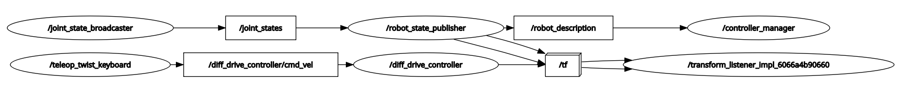
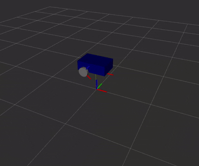

# 🚗 ROS 2 Control Cart — Keyboard Teleop

A minimal **ROS 2 differential-drive cart** controlled via **ros2_control** with **keyboard teleop**.  
Includes URDF (xacro), controller config, and RViz display for quick verification.

> 

---

## 🌀 Demo
> Add your GIF to `images/demo.gif` and it will show here.



---

## 🛠️ Features
- `diff_drive_controller` + `joint_state_broadcaster`
- Xacro-based mobile base (`wheel_separation`, `wheel_radius` parameters)
- RViz2 visualization (`/robot_state_publisher`, `/tf`)
- Keyboard teleop (`teleop_twist_keyboard` → `/diff_drive_controller/cmd_vel`)

---

## 📦 Workspace Layout

```
ros2_control_cart_ws/
|___ src/
     |___ my_robot_description/
     |    |___ urdf/
     |    |    |___ common_properties.xacro
     |    |    |___ mobile_base.xacro
     |    |    |___ mobile_base.ros2_control.xacro
     |    |    |___ my_robot.urdf.xacro
     |    |
     |    |___ launch/
     |    |    |___ display.launch.xml
     |    |    |___ display.launch.py
     |    |
     |    |___ rviz/
     |    |    |___ urdf_config.rviz
     |    |
     |    |___ package.xml
     |    |___ CMakeLists.txt
     |
     |___ my_robot_bringup/
          |___ config/
          |    |___ my_robot_controllers.yaml
          |
          |___ launch/
          |    |___ my_robot.launch.xml
          |
          |___ package.xml
          |___ CMakeLists.txt

```

---

## ✅ Requirements
- ROS 2 Humble (or later)
- Packages: `ros2_control`, `ros2_controllers`, `xacro`, `robot_state_publisher`, `rviz2`, `teleop_twist_keyboard`

Install dependencies:
```bash
rosdep install --from-paths src --ignore-src -r -y

🚀 Build & Run

# Build
colcon build
source install/setup.bash

# Launch robot (robot_state_publisher, controllers, RViz)
ros2 launch my_robot_bringup my_robot.launch.xml

# Keyboard teleop (WASD keys) → remap to diff_drive controller input
ros2 run teleop_twist_keyboard teleop_twist_keyboard \
  --ros-args -r cmd_vel:=/diff_drive_controller/cmd_vel

